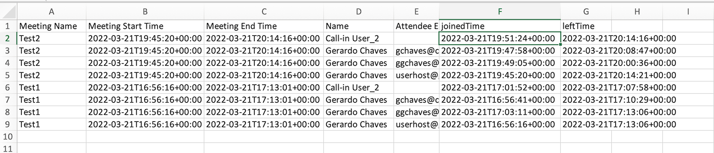

# GVE DevNet Webex Meetings Attendance Reports Collector  

Sample web application that allows a user to log in and download consolidated attendance reports for all Webex Meetings they have hosted selected from a date range. 


## Contacts
* Gerardo Chaves (gchaves@cisco.com)
* Faizan Hussain (faizhuss@cisco.com)
* Michael Snider (misnider@cisco.com)

## Solution Components
* Webex REST API
* Python 
* Flask
* Javascript
* HTML
* CSS

## Requirements
* Python 3.6 or higher  

## Related Sandbox Environment
This sample code can be tested using a Cisco dCloud demo instance that contains a Webex Organization and access to Control Hub

## Coding Guides and resources

Example Oauth with Webex Teams:  
https://github.com/CiscoDevNet/webex-teams-auth-sample  

Walkthrough including how to refresh tokens:  
https://developer.webex.com/blog/real-world-walkthrough-of-building-an-oauth-webex-integration  

Refresh token example:  
https://stackoverflow.com/questions/27771324/google-api-getting-credentials-from-refresh-token-with-oauth2client-client  

Downgrading the requests-oauthlib library to version 1.0.0 to avoid the OAuth error I was getting:  
https://github.com/requests/requests-oauthlib/issues/324  


## Installation/Setup
It is recommend to set up a Python environment as follows to install the code on your machine or a virtual machine on a server:  

In the CLI:
1. Choose a folder, then create and activate a virtual environment for the project  
    ###Windows:
    ```python  
    py -3 -m venv attendance  
    attendance\Scripts\activate.bat  
    ```  
     
    ###MacOS/Linux:
    ```python 
    python3 -m venv attendance
    source attendance/bin/activate
    ```

3. Access the created virtual enviroment folder
    ```python
    cd attendance
    ```

4. Clone this Github repository into the virtual environment folder.
    ```python
    git clone [add github link here]
    ```

5. Access the folder **gve_devnet_webex_meetings_attendance_reports_collector**
    ```python
    cd gve_devnet_webex_meetings_attendance_reports_collector
    ```

6. Install dependencies
    ```python
    pip install -r requirements.txt
    ```

### Required Webex Integration for this sample
This sample that requires that you create a Webex Integration in your organization so that the `app.py` script can provide 
an oAuth flow to log in users with their Webex credentials.  
See the [Webex Integrations](https://developer.webex.com/docs/integrations) documentation for more details.  
Use the following scopes when creating the Integration:  
``` 
'spark:people_read','meeting:schedules_read', 'meeting:preferences_read','meeting:participants_read','meeting:transcripts_read' 
```
If you keep the default settings for the oAuth flow in code in the app.py code, use the following Redirect URI when creating the integration:  
http://0.0.0.0:3000/callback  
This will have to change if later run the sample on a different port or IP address.  
Once the integration is created, take note of the Client ID and Secret generated to use in the environment variables below.    
NOTE: In Windows you cannot easily use 0.0.0.0 as the local IP address but rather 127.0.0.1 . Use http://127.0.0.1:3000/callback for the Redirect URI field then.  

Once the Webex Integration is created, you can edit the `.env` file in the directory where you cloned this repository to fill out the following configuration variables:

**CLIENT_ID**     
Set this constant to the Client ID from your meetings integration set above.

**CLIENT_SECRET**
Set this constant to the Client Secret from your meetings integration set above.   

Also, in the `app.py` file, configure the following variable:

**PUBLIC_URL**
Set PUBLIC_URL to the URL where your instance of this Flask application will run. If you do not change the parameters 
of app.run() at the end of the main.py file, this should be the same value of 'http://0.0.0.0:3000' that is set by default 
in the sample code.  
NOTE: This URL does not actually have to map to a public IP address out on the internet.  
NOTE: In Windows you cannot easily use 0.0.0.0 as the local IP address but rather 127.0.0.1 . Use http://127.0.0.1:3000  instead.  


## Usage
 
1. Run the application in the directory
    ```python
    python app.py
    ```

2. Navigate to the local application on your browser http://0.0.0.0:3000 , http://127.0.0.1:3000 or whatever URL and port you set in the `app.run()` call in the app.py file.

3. Log into the application using the credentials of a Webex Meetings user to see select meetings that occured in the past to generate attendance reports:  
    * The user must be a member of the Webex Teams organization that you created the integration with.  
    * The user must have the permissions to view the meeting schedule and transcripts.    

  
  
The current day and any past meetings (if any) for the logged in user will be pre-selected:
  

  

5. If you wish to use a differente date range, select it by clicking on the existing range shown the blue button and select the new range 
you want to collect meetings attendance for:  
  
  

6. Confirm the selection of the meetings you wish to include in the report  


7. Click the 'Generate Meetings Report' button:   

  


8. The report will be generated and downloaded to your local machine in the Downloads folder as configured in your browser:  

  


### LICENSE

Provided under Cisco Sample Code License, for details see [LICENSE](LICENSE.md)

### CODE_OF_CONDUCT

Our code of conduct is available [here](CODE_OF_CONDUCT.md)

### CONTRIBUTING

See our contributing guidelines [here](CONTRIBUTING.md)

#### DISCLAIMER:
<b>Please note:</b> This script is meant for demo purposes only. All tools/ scripts in this repo are released for use "AS IS" without any warranties of any kind, including, but not limited to their installation, use, or performance. Any use of these scripts and tools is at your own risk. There is no guarantee that they have been through thorough testing in a comparable environment and we are not responsible for any damage or data loss incurred with their use.
You are responsible for reviewing and testing any scripts you run thoroughly before use in any non-testing environment.